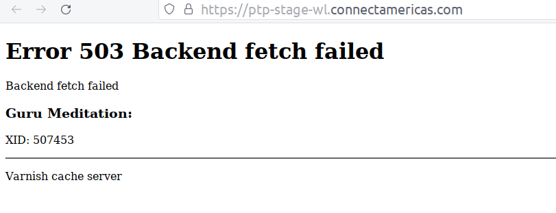

# Manual Testing

Apply Manual Testing to the Indicator Dashboard feature of **Compra Lo Nuestro**, a White Label of Connect Americas. In order to verify that is according to the created and comply with the client requirements.

Credentials for this test are not shared in this repository.

## Files in this repository

The files in this repository are organized as shown in the image below.
Bug reports are in a public `Spreadsheet` file, share in the [Bug Report section](https://github.com/isabelyb/QA-Assesment/tree/manual#3-bug-reports).

# Tester requirements

## 1. Exploratory Testing

Exploratory testing is a method to test the software, in which tests are not pre-defined. Therefore, those tests are designed, executed, logged, and evaluated during the evaluation, and its results allow learning more about the software tested and the creation of more tests in case necessary.

Exploratory testing is most used when:
* There is not time enough to test all functionalities
* To complement other more formal testing techniques.
* There are not documentation and specifications enough about the software

Sources:

* [Foundation Level (CTFL) Syllabus - ISTQB](https://istqb-main-web-prod.s3.amazonaws.com/media/documents/ISTQB-CTFL_Syllabus_2018_v3.1.1.pdf)
* [Exploratory testing - Atlassian](https://www.atlassian.com/continuous-delivery/software-testing/exploratory-testing)

## 2. Test Cases

Test cases in `Gherkin` for "Cantidad de Empresas" section:

* [By Sector](testCases/byCompanies/bySector.feature)
* [By Department](testCases/byCompanies/byDepartment.feature)
* [By Category](testCases/byCompanies/byCategory.feature)

It is possible to do all in one test using an `Scenario outline`:

* [By Companies - Scenario outline](testCases/byCompanies.outline.feature)

## 3. Bug Reports

This is the entire file with the bug reports: 

🐞 [Here the entire bug reports](https://docs.google.com/spreadsheets/d/1u1QKv56hdA59uOP3MtTf8VhnrHuEM0kol_1WWiRWHFI/edit?usp=sharing)

## 4. Improvements to the dashboard

✨ [Here the entire improvement reports](https://docs.google.com/spreadsheets/d/1u1QKv56hdA59uOP3MtTf8VhnrHuEM0kol_1WWiRWHFI/edit?usp=sharing)

* **Error 503:** Thisi is a very common situation with this website, that is mean the user watch this screen a
lot of times, and this screen doesnt mean any thing.
A friendly message can be a difference in perception of the cient with the product.

## 5. Conclusions
* Exploratory testing is the principal technique when the documentation is not enough to know the application and when it is necessary to complement the testing process.

* In the CLN project, were found two situations that did not permit a complete testing process in the designated time:

    * First, the cache that works intermintente,  doing dificult to test the site because of the availability.

    * Second, an iterative website is necesarioto to maintain the testing, but it is important to accord with tester in order not to lost time., in this case this is an excesice and there is not a relevant consecuencies but in the produtive case the many representes lost of resourses.

    * Despite, those dificulties the site was tested and  its Numbers are very important to take desitions this is the most m¿important feature and it is absolutly necesary to acomplisht with the clinet requierment because a little representation in the data cab be a bias in the desition takin process.

* It is very important to have evidence of all findigs found, to permit its reproducibility, and in consequence to work in the solution o improvement.

* Finally, but not less important it is to understand the objective of every tester is orienting their actions to guarantee, in the possible, the product complies with the client and design requirements, and finally, the product serves for the reason has been created.

---
[Come back to *main* branch](https://github.com/isabelyb/QA-Assesment/tree/main)