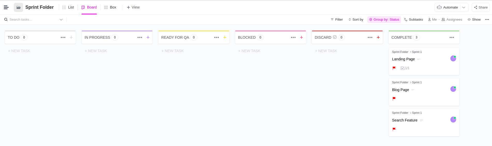
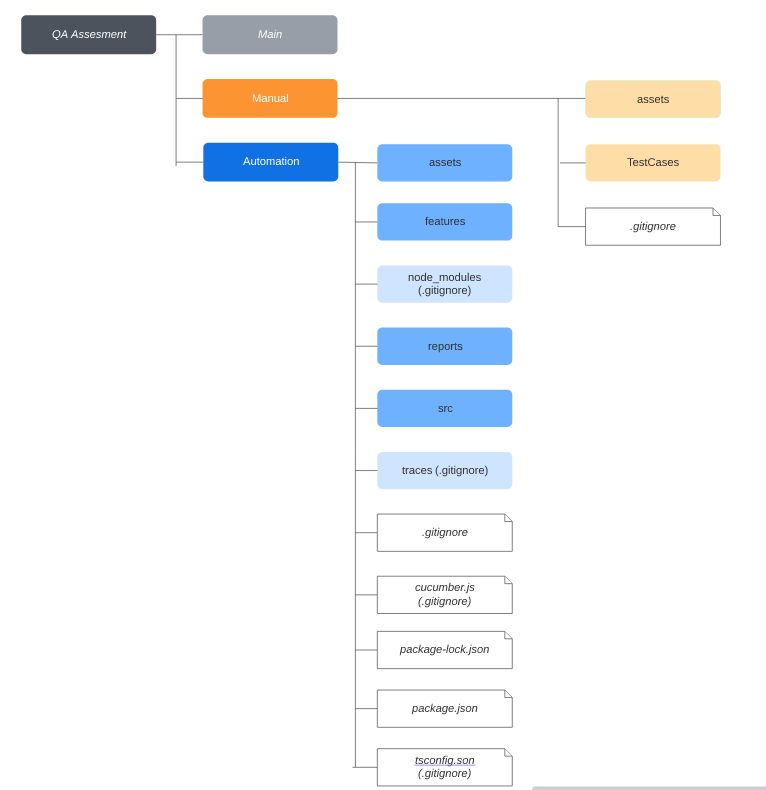
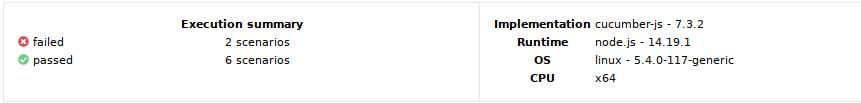
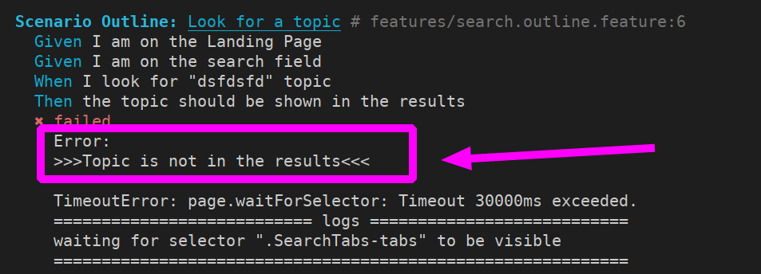
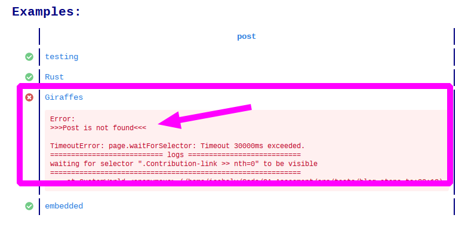

# Automation Testing

Cases to automatize using `Playwright`, `Cucumber` y `Gherkin`

**Steps:**
1. Go to the website
2. From search feature, look for `X` topic
3. go throug upper tags (_Cursos_, _Escuelas_, _Clases_), and count the page for each tag.
4. go to first course and obtain the quantity of opinions.
5. Go to blog page and look for a `Y` topic
6. Order the result list by _Más votados_,
7. Obtain the first result and show the name and its likes.ikes.

➡️ [Code here](https://github.com/isabelyb/QA-Assesment/tree/automation##repository)

# Tester requirements

 ## Ticketing System

  [**Clickup:**](https://app.clickup.com/3094033/v/s/49677468) is ised as a ticketing system to assingn tasks to developer and then to receibe a ticket for QA automation process, one the automation and the test are renned is moved to complete state, to be assigne to assesment review.

 ## Repository

This is the file structure in this repository, according to the proyect to test, and it is inspired by [Tallyb repository](https://github.com/Tallyb/cucumber-playwright):

 
  * Reports:

  
 
* **Errors:** Error are managed by `try - catch` and are reported in the terminal and in the report.
 
 

 * **Commits:** to see this repository commits go [here](https://github.com/isabelyb/QA-Assesment/commits/automation)

 * To run this repo in local, follow the instructions [here]

 * To read [**Issues** here](https://github.com/isabelyb/QA-Assesment/issues)
 
 ## Steps to do the assesment

1. Read the problem
2. Do Exploratory Testing
3. Make questions to clarify the tasks
4. Break down in steps
5. Assign tasks in clickup
6. Add `automation branch` to repository
7. Initial configuration: 
    * configure: `nvm use v14.19.1`
    * `.git ignore` file
    * `cucumber.js` file
    * `pom.ts` file
    * `README.md` file
    * Make directories
    * `npm init` to configure `package.json`
    * `npm install` to install dependencies
8. Write [Test Cases](https://github.com/isabelyb/QA-Assesment/tree/automation/features) in `Gherkin` Syntaxis
9. Write [steps and scripts](https://github.com/isabelyb/QA-Assesment/tree/automation/src) in `Typescript`
13. Run tests
14. Fix issues
15. Refactor code
16. Fix issues
17. Update documentation

## To run in local

 1. Clone repository
 2. npm install
 3. Run test
 4. Run report

