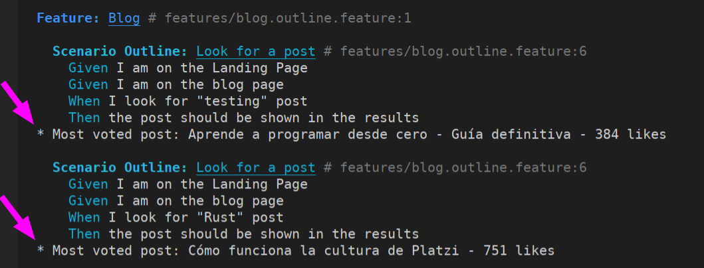
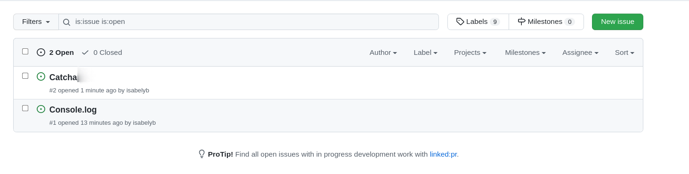

# Automation Testing

Cases to automatize using `Playwright`, `Cucumber` y `Gherkin`

**Steps:**
1. Go to the website
2. From search feature, look for `X` topic
3. Go through upper tags (_Cursos_, _Escuelas_, _Clases_), and count pages for each tag
4. Go to first course and obtain the quantity of opinions
5. Go to blog page and look for a `Y` topic
6. Order the result list by _Más votados_
7. Obtain the first result and show the name and _likes_

# Tester requirements

 ## Ticketing System

  [**Clickup:**](https://app.clickup.com/3094033/v/s/49677468) Is used as a ticketing system to assign tasks to developer and then to receive a ticket for QA automation process, one the automation and the test are run is moved to complete state, to be assign to assessment review.

 ## Repository

This is the file structure in this repository, according to the project to test, and it is inspired by [Tallyb repository](https://github.com/Tallyb/cucumber-playwright):

 
  * **Reports:** Reports of run tests are shown in terminal or by `run test report` command, it throws an HTML report in the browser.

  
 
  

  
  
* **Errors:** Error are managed by `try - catch` and are reported in the terminal and in the HTML report.  

 
 

 * **Commits:** to see this repository commits go [here](https://github.com/isabelyb/QA-Assessment/commits/automation)

 * To **run this project in local**, follow the instructions [here](https://github.com/isabelyb/QA-Assessment/tree/automation#to-run-in-local)

 * [**Issues** here](https://github.com/isabelyb/QA-Assessment/issues)
 
 
 ## Steps to accomplish the Assessment

1. Read the problem
2. Do Exploratory Testing
3. Make questions to clarify the tasks
4. Break down in steps
5. Assign tasks in clickup
6. Add `automation branch` to repository
7. Initial configuration: 
    * configure: `nvm use v14.19.1`
    * `.git ignore` file
    * `cucumber.js` file
    * `pom.ts` file
    * `README.md` file
    * Make directories
    * `npm init` to configure `package.json`
    * `npm install` to install dependencies
8. Write [Test Cases](https://github.com/isabelyb/QA-Assessment/tree/automation/features) in `Gherkin` Syntaxis
9. Write [steps and scripts](https://github.com/isabelyb/QA-Assessment/tree/automation/src) in `Typescript`
13. Run tests
14. Fix issues
15. Refactor code
16. Fix issues
17. Try in my local machine. Reproducing all the steps from the beginning to assure that it works
18. Update documentation

## To run in local

 1. Clone repository `git clone git@github.com:isabelyb/QA-Assessment.git` or `git clone https://github.com/isabelyb/QA-Assessment.git`
 2. Switch to automation branch `git checkout automation`
 3. Install dependencies `npm install` and **fix all vulnerabilities before run tests**
 4. Configure nvm version `nvm use v14.19.1`
 5. Run tests: There are two Scenarios Outline  

    5.1. `Look for a topic` to test the first part in the search feature. There are 4 examples to run. Three with happy path.

    5.2. `Look for a post` to test the second part in the blog page. There are 4 examples to run. Three with happy path.

    * `npm run test` runs all tests
    * `PWDEBUG=0 npx cucumber-js --name <Scenario>` run the single scenario without debug feature
    * `PWDEBUG=1 npx cucumber-js --name <Scenario>` run the single scenario with debug feature
 6. Run report `npm run report`

 ---
[Come back to *main* branch](https://github.com/isabelyb/QA-Assessment/tree/main)

